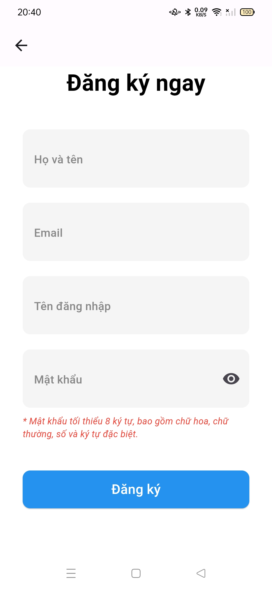
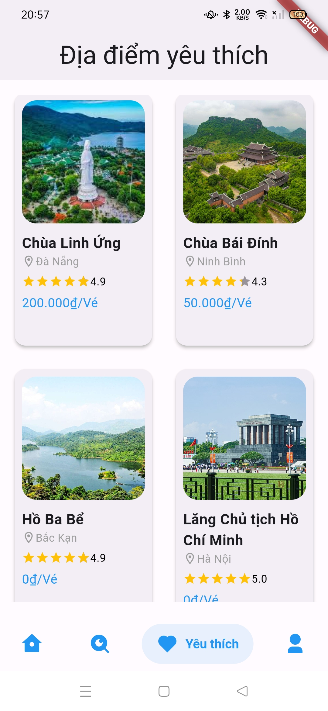

# VietTravel_App

## Mô tả:
- Ứng dụng Đặt vé tham quan các địa điêm du lịch tại Việt Nam.
- Ngôn ngữ: Dart
- Framework: Flutter

## Giao diện của App:

    
    
    
    
    
    
    
    
    
    
    
    
    
    
    
    

